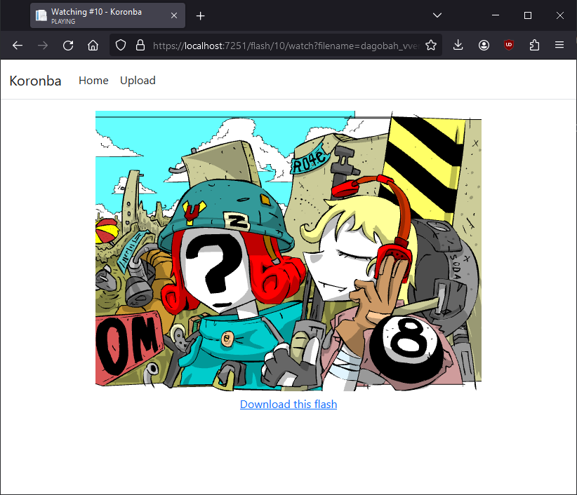

  <b>Koronba (ころんば) - A Flash archival/cataloguing utility.</b>

---

**Koronba** is a self-hostable archiving tool for Adobe Flash content, similar to sites like swfchan. It has the ability to check for duplicates and assign seen filenames, group Flash content by tags and much more!

# Usage

To run the project, run the **Koronba.Web** front-end project. Koronba itself doesn't depend on the MVC web front-end and can be safely used outside of it, by referencing the **Koronba.Core** project.

# TODOs

- [x] File uploading
- [x] De-duplicate flash content and group known file names
- [ ] Thumbnail generation
- [ ] Gathering metadata from 
- [ ] Tags
- [ ] Ratings
- [ ] Switch away from Sqlite3
- [ ] An alright looking front-end

# Contributing Guide

If you'd really want to contribute to this project (thank you!) please adhere to the [Conventional Commits](https://www.conventionalcommits.org/en/v1.0.0/) commit format as much as you can.
